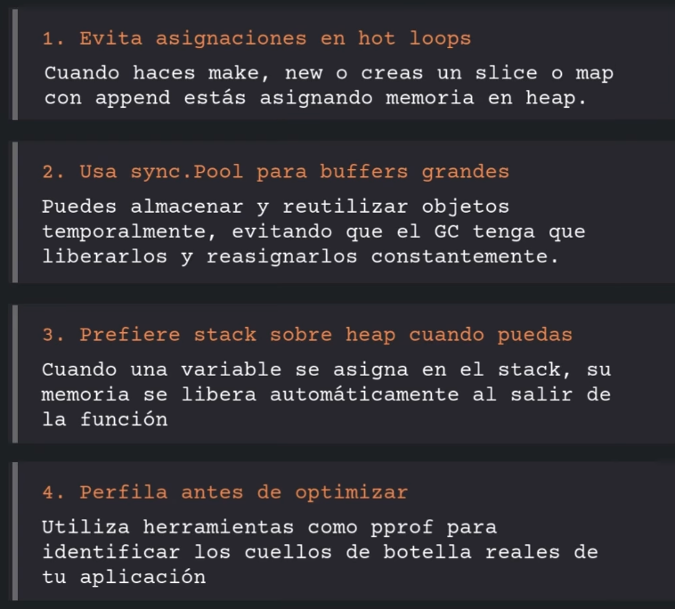

# reglas-programacion-GO

<!-- Para agregar el video: Ve a GitHub.com, edita este archivo y arrastra el video aquí -->



## Goroutines por Dentro (Scheduler M:N)

### ¿Qué son las Goroutines?

Las **goroutines** son pequeñas unidades de ejecución concurrente en Go, similares a "scooters" que corren de manera
eficiente:

- Inician con solo **2KB de stack** (muy ligero comparado con threads tradicionales)
- Su stack **crece o decrece dinámicamente** según la necesidad
- Permiten ejecutar **múltiples tareas en paralelo** sin afectar significativamente la RAM o CPU

### Los 3 Componentes Clave del Scheduler

El scheduler de Go funciona alrededor de 3 componentes fundamentales:

```
┌─────────────────────────────────────────────────────────┐
│  G = Goroutine (unidad de ejecución)                    │
│  M = Machine (hilo del SO que ejecuta el código)        │
│  P = Processor (capacidad de procesamiento/contexto)    │
└─────────────────────────────────────────────────────────┘
```

### Modelo Scheduler M:N

El scheduler de Go implementa un modelo **M:N**, donde:

- **M** goroutines se multiplexan sobre **N** threads del sistema operativo
- Esto permite tener miles de goroutines ejecutándose eficientemente sobre pocos threads

### Diagrama de Arquitectura

```
┌─────────────────────────────────────────────────────────────┐
│                    Runtime Scheduler                        │
└─────────────────────────────────────────────────────────────┘
                            │
        ┌───────────────────┼───────────────────┐
        │                   │                   │
        ▼                   ▼                   ▼
    ┌───────┐          ┌───────┐          ┌───────┐
    │   P1  │          │   P2  │          │   P3  │
    │ (ctx) │          │ (ctx) │          │ (ctx) │
    └───┬───┘          └───┬───┘          └───┬───┘
        │                  │                  │
     ┌──┴──┐            ┌──┴──┐            ┌──┴──┐
     │  M1 │            │  M2 │            │  M3 │
     │(OS) │            │(OS) │            │(OS) │
     └─────┘            └─────┘            └─────┘
        │                  │                  │
        ▼                  ▼                  ▼
     ┌─────┐            ┌─────┐            ┌─────┐
     │  G1 │            │  G5 │            │  G8 │
     │  G2 │            │  G6 │            │  G9 │
     │  G3 │            │  G7 │            │ G10 │
     │  G4 │            └─────┘            └─────┘
     └─────┘
   (Run Queue)        (Run Queue)        (Run Queue)
```

**Leyenda:**

- **P (Processor)**: Contexto de ejecución con cola local de goroutines
- **M (Machine)**: Thread del sistema operativo
- **G (Goroutine)**: Funciones ejecutándose concurrentemente

### Flujo de Ejecución

```
┌──────────────────────────────────────────────────────────────┐
│ 1. Se crea una nueva Goroutine (go func())                   │
└────────────────────────┬─────────────────────────────────────┘
                         │
                         ▼
┌──────────────────────────────────────────────────────────────┐
│ 2. Se asigna a la cola local de un P (Processor)             │
└────────────────────────┬─────────────────────────────────────┘
                         │
                         ▼
┌──────────────────────────────────────────────────────────────┐
│ 3. M (Thread) asociado al P toma la G de la cola             │
└────────────────────────┬─────────────────────────────────────┘
                         │
                         ▼
┌──────────────────────────────────────────────────────────────┐
│ 4. M ejecuta el código de G                                  │
└────────────────────────┬─────────────────────────────────────┘
                         │
           ┌─────────────┴─────────────┐
           │                           │
           ▼                           ▼
┌────────────────────┐      ┌────────────────────┐
│  G termina         │      │  G se bloquea      │
│  M busca otra G    │      │  (I/O, channel)    │
└────────────────────┘      └────────┬───────────┘
                                     │
                                     ▼
                          ┌────────────────────────┐
                          │ M se desasocia del P   │
                          │ Otro M toma el P       │
                          │ G bloqueada espera     │
                          └────────────────────────┘
```

### Diagrama de Secuencia: Work Stealing

Cuando un P se queda sin trabajo, "roba" goroutines de otros procesadores:

```
P1 (ocupado)              P2 (idle)              P3 (ocupado)
    │                         │                      │
    │ [G1, G2, G3, G4]        │ []                   │ [G8, G9]
    │                         │                      │
    │                         │ Detecta cola vacía   │
    │                         │─────────────────────▶│
    │                         │                      │
    │                         │◀─ Steal G9 ─────────│
    │                         │                      │
    │ [G1, G2, G3, G4]        │ [G9] ✓               │ [G8]
    │                         │                      │
    ▼                         ▼                      ▼
Ejecutando G1             Ejecutando G9          Ejecutando G8
```

### Ventajas del Scheduler M:N

1. **Eficiencia**: Miles de goroutines sobre pocos threads del SO
2. **Balance de carga**: Work stealing distribuye la carga automáticamente
3. **Baja latencia**: Cambio de contexto rápido entre goroutines
4. **Escalabilidad**: Aprovecha múltiples cores sin overhead significativo

### Ejemplo Práctico

```go
package main

import (
	"fmt"
	"runtime"
	"time"
)

func worker(id int) {
	fmt.Printf("Worker %d iniciando\n", id)
	time.Sleep(time.Second)
	fmt.Printf("Worker %d terminando\n", id)
}

func main() {
	// Ver cantidad de procesadores (P)
	fmt.Printf("CPUs disponibles: %d\n", runtime.NumCPU())

	// Crear múltiples goroutines
	for i := 1; i <= 10; i++ {
		go worker(i)
	}

	// Esperar a que terminen
	time.Sleep(2 * time.Second)

	// Ver estadísticas del runtime
	fmt.Printf("Goroutines activas: %d\n", runtime.NumGoroutine())
}
```

---

